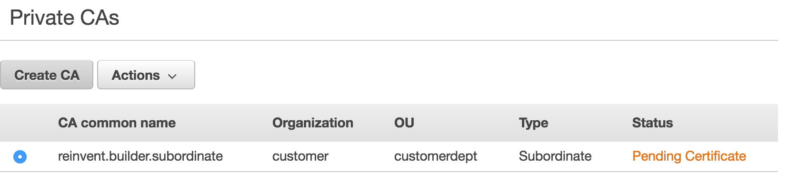

<<<<<<< HEAD
# AWS Data Protection Workshops

If you are dealing with data protection with methods such as encryption or certificate management within your AWS infrastructure, these workshops can help. We will be using the Cloud9 IDE and a combination of python code and AWS console access for these workshops.

# Ubiquitous Encryption 

Data encryption provides a strong layer of security to protect data that you store within AWS services. AWS provides tooling to achieve ubiquitous encryption 
for data in transit as well as data at rest.

# Prerequisites

### AWS Account

In order to complete these workshops you'll need a valid, usable AWS Account with Admin permissions.  The code and instructions in these workshops assume only one student is using a given AWS account at a time. If you try sharing an account with another student, you'll run into naming conflicts for certain resources. 

Use a **personal account** or create a new AWS account to ensure you have the neccessary access. This should not be an AWS account from the company you work for.

If the resources that you use for this workshop are left undeleted you will incur charges on your AWS account.

### Cloudformation templates for initial environment setup

Please run these cloudformation stacks in your AWS account as this is required for all the workshops

### Step 1 :

The above stack creates an IAM user called **builder** .

### Before you proceed to Step 2

Please login into your account with the username **builder** . The password for this user is **reinvent**

### Step 2 :

The above stack creates an Cloud9 IDE environment called **workshop-environment** 

### Step 3 :

* Navigate to the Cloud9 service within your AWS console
* In the Cloud9 IDE environment you will find a folder called **data-protection-workshops** in the folder pane on the left side of the screen
* Open the file named **environment-setup.py**  in the IDE
* Run the python module **environment-setup.py** by clicking the play button 
 on the top pane 
* In the runner window below you should see **Workshop environment setup was successful** printed

# Workshops

**Please review and complete all the above prerequisites before attempting these workshops.**

<!DOCTYPE html>
<html>
<body>

<kbd>

</kbd>
<kbd>

</kbd>
 

</body>
</html>

### Browser

These workshops assume you are using a Cloud IDE environment. We recommend you use the latest version of Chrome or Firefox to complete this workshop.

## License Summary

This sample code is made available under a modified MIT license. See the [LICENSE](LICENSE) file.
=======
## ACM Private Certificate authority - Private certs for your webserver 

This workshop demonstrates how ACM Private Certificate authority(PCA) can be created and made operational. It also helps you learn
about how ACM PCA can be used to generate private certificates for your web applications that are not exposed to the public internet.

## Let's look at some concepts :

 
 

## Let's do some private cert generaton with AWS Certificate Manager(ACM) private certificate authority(PCA) :

Open the Cloud9 IDE environment called **workshop-environment**. Within the Cloud9 IDE open the bash terminal and use the following command to checkout code for this usecase :

**git checkout acm-pca-usecase-5**

Once you run the command above you will see a folder called **usecase-5** in the Cloud9 environment. Follow the below steps:

### Step 1 :

Run the python module named ***intial-config-step-1.py***

* First you will see **"Pending DynamoDB table creation for storing shared variables"** printed on the runner window pane below
* Wait for about 45 seconds 
* You should see **"shared_variables_crypto_builders DynamoDB table created"** printed on the runner window pane below

This module will create a DynamoDB table called **shared_variables_crypto_builders** . The primary purpose of this table is to share variables
across the different python module that we will run in this usecase.

### Step 2 :

Run the python module named ***usecase-5-step-2.py***

* This module creates a ACM private certificate authority with the common name **acmpcausecase5.subordinate**
* This private certificate authority will publish certificate revocation lists within a S3 bucket whose name
  starts with **builder-acm-pca-usecase-5-bucket-pca-crl**
* You should see the following printed in the runner window pane
    * "Private CA has been created"
    * "Please generate the CSR and get it signed by your organizations's root cert"
    * "Success : The ARN of the subordinate private certificate authority is : "
       arn:aws:acm-pca:<region>:<your-acccount-number>:certificate-authority/57943599-30d2-8723-1234-1cb4b7d81128
* In the AWS console browse to the AWS Certificate Manager service(ACM) . Under Private CA's you will see the private CA created and
  the status should show "Pending Certificate"

 

**Some questions to think about :**

* Why is the status of the private CA showing "Pending Certificate" ?
* Is the private certificate authority that's created a root CA or a subordinate CA ?
* What's the purpose of the S3 bucket storing certificate revocation lists ?

### Step 3 :

Run the python module named ***usecase-5-step-3.py***

* This module creates a self signed root certificate with the common name **rootca-builder**
* You can see in the code that the private key associated with the self signed cert is stored in an encrypted DynamoDB table.
  This is purely for demonstration purposes. In your organization you should store it in an HSM or a secure vault
* You should see the following printed in the runner window pane below 
   * Success - Self signed certificate file ***self-signed-cert.pem*** created"
   * "This self signed certificate will be used in the certificate chain of trust"
 
 

**Some questions to think about :**

* In your organization would you use the root cert to sign subordinate CA's ?
* Why is it necessary to store the private keys of root certs in an HSM ?
* What would happen if the private key of the root cert gets compromised or stolen ?

### Step 4 :

Run the python module named ***usecase-5-step-4.py***

* This module gets a Certificate signing request(CSR) for the private certifiate authority with 
  common name **reinvent.builder.subordinate** that was created in **Step 2**
* The certificate signing request is signed using the self signed certificate and it's private key 
  that was created in **Step 3** 
* The signed cert is stored in a pem file called ***signed_subordinate_ca_cert.pem***
* You should see the following printed in the runner window pane below 
   * Successfully created signed subordinate CA pem file ***signed_subordinate_ca_cert.pem*** 

### Step 5 :

Run the python module named ***usecase-5-step-5.py***

* This module imports the subordinate CA signed certificate ***signed_subordinate_ca_cert.pem*** and 
  certificate chain of trust into AWS Certificate Manager(ACM)
* The certificate chain contains the self signed CA certificate that we created in **Step 3**
* After this operation the subordinate privcate certificate authority(CA) changes status to ACTIVE. 
* Browse to the ACM service within the AWS console and you should see the status of the subordiate CA with 
  common name **reinvent.builder.subordinate** as ACTIVE as shown below
* We are at a point where the subordinate private certificate authority(PCA) can issue private certificates
  for any endpoint, device or server
* You should see the following printed in the runner window pane below 
   * Successfully imported signed cert and certificate chain into ACM

### Step 6 :

**Time : 2 minutes**

Run the python module named ***usecase-5-step-6.py***

* This module takes about 2 minutes to complete 
* This module creates a CSR for a webserver endpoint with common name ***127.0.0.1*** and the CSR is then
  passed to the issue_certificate API call which sends the CSR to AWS Certificate Manager and is signed
  by the subordinate private certificate authority that was created earlier 
* The signed webserver endpoint certificate pem file is called ***"webserver_cert.pem"***
* The issue_certificate API calls also returns the certificate chain of trust and the pem file that stores the
  chain of trust is called ***"webserver_cert_chain.pem"***
* You should see the following printed in the runner window pane below 
    * Successfully created server certificate ***webserver_cert.pem*** for the flask web server
    * Successfully created chain of trust ***webserver\_cert_chain.pem*** for the flask web server

### Step 7 :

Run the python module named ***usecase-5-step-7.py***

* This module creates a python flask web server with an HTML page that prints **"Hello World"**
* The webserver is running within the Cloud9 environment and is exposed through the following
  URL **https://127.0.0.1:5000/**
* You should see the following printed in the runner window pane below 
   * Running on https://127.0.0.1:5000/ 
* For the next steps this webserver needs to keep running. So please don't kill the runner window pane tab

### Step 8 :

Run the python module named ***usecase-5-step-8.py***

* This module uses the below curl command to do a HTTP GET on the flask webserver created in **Step 7** 

  curl --verbose -X GET https://127.0.0.1:5000/
  
* We are using the curl command to simulate a HTTPS web client 

* Since the curl commmand does not supply the certificate trust chain as a parameter the HTTPS connection is going to
  complain that the server certificate is not recognized. You will see the following printed in the runner window
  pane below if you look through the printed log 

  ** curl: (60) Peer's Certificate issuer is not recognized **
  ** Certificate is not trusted - cannot validate server certificate **

**Some questions to think about :**

* Why was the server certificate not recognized by the curl command ?

### Step 9 :

Run the python module named **usecase-5-step-9.py**

* This module uses curl to do a HTTPS GET on the flask webserver created in Step 7 using the following command :

  curl --verbose --cacert 'webserver_cert_chain.pem' -X GET https://127.0.0.1:5000/
  
* Since the curl command has the chain of trust pem file as a parameter the flask webserver certificate
  is successfully authenticated and you should see the following printed in the runner window pane.

  **Hello World!**
  
  **Certificate is trusted and is valid**
  

>>>>>>> codecommit/acm-pca-usecase-5
