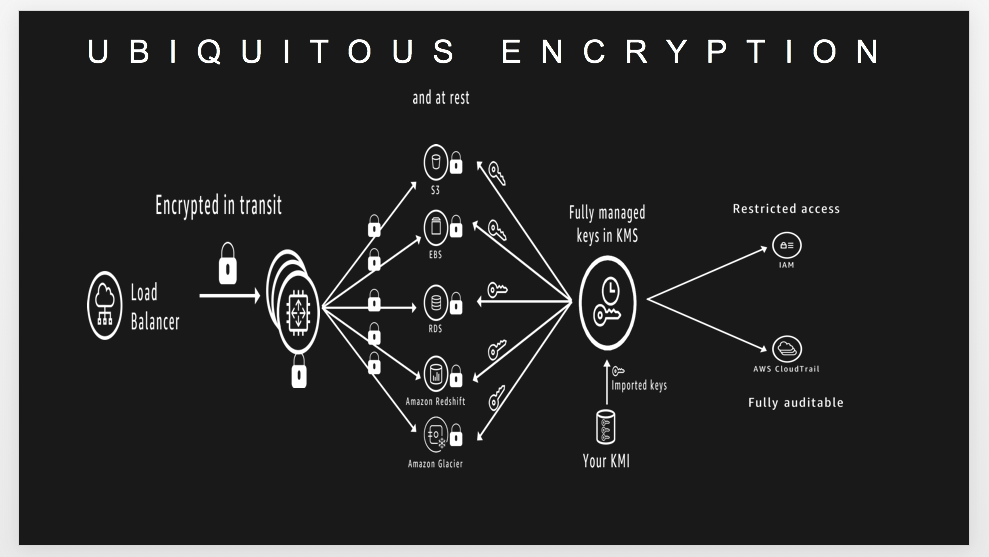
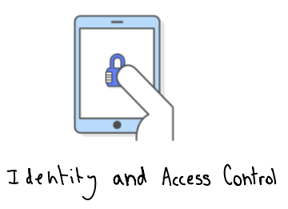
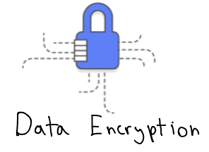

# AWS Data Protection Workshops

If you are dealing with protecting data on your AWS architecture using methods such as encryption or certificate management, these workshops can help you learn in depth. We will be using the Cloud9 IDE and a combination of python code and AWS console access for these workshops.

# Ubiquitous Encryption 

Data encryption provides a strong layer of security to protect data that you store within AWS services. AWS services can help you achieve ubiquitous encryption 
for data in transit as well as data at rest.

# Prerequisites

### AWS Account

In order to complete these workshops you'll need a valid active AWS Account with Admin permissions.  The code and instructions in these workshops assume only one student is using a given AWS account at a time. If you try sharing an account with another student, you'll run into naming conflicts for certain resources. 

Use a **personal account** or create a new AWS account to ensure you have the neccessary access. This should not be an AWS account from the company you work for.

If the resources that you use for this workshop are left undeleted you will incur charges on your AWS account.

### Cloudformation templates for initial environment setup

Please run these cloudformation stacks in your AWS account as this is required for all the workshops in this repository.

### Step 1 :

The above stack creates an IAM user called **builder** with the password **reinvent**. 

### Before you proceed to Step 2

Please login into your account with the username **builder** . You need to change the password on login.

### Step 2 :

The above stack creates an Cloud9 IDE environment called **workshop-environment** .

### Step 3 :

* Navigate to the Cloud9 service within your AWS console
* Open the Cloud9 IDE environment called **workshop-environment** .It takes about 30 seconds for the
  environment to start up.
* In the Cloud9 IDE environment you will find a folder called **data-protection** in the folder pane on the left side of the screen
* Open the file named **environment-setup.py**  in the IDE
* Run the python module **environment-setup.py** by clicking the play button 
  on the top pane 
* This module would take about a minute to complete
* In the runner window below you should see **Workshop environment setup was successful** printed
* At this point the cloud9 environment is ready for the workshops

# Workshops

**Please review and complete all the above prerequisites before attempting these workshops. The images below are clickable links**

<!DOCTYPE html>
<html>
<body>

<kbd>

</kbd>
<kbd>

</kbd>
 

</body>
</html>

# Browser

These workshops assume that you are using a Cloud IDE environment. We recommend you use the latest version of Chrome or Firefox to complete this workshop.

# Final Cleanup

Once you you have finished working on the workshops within this repository ,the final step is to clean up the resources by deleting
the cloudformation stacks that setup the workshop environment. For cleanup follow the steps below :

### Step 1 :

Within the Cloud9 IDE **workshop environment** that you used for this workshop checkout the final clean up branch
by using the following command :

**git checkout final-cleanup**

### Step 2 :

* In the Cloud9 IDE you will find a python module called ***final-cleanup.py***
* Run the **final-cleanup.py** python module 
* At this point cleanup of the cloudformation stacks is intitiated
* It takes about 3 minutes for the cloudformation stacks named **data-protection-iam-user-creation**
  and **data-protection-env-setup** to be deleted
* If you are logged in as user **builder** you will be logged out and the Cloud9 IDE **workshop environment**
  session will be terminated.

## License Summary

This sample code is made available under a modified MIT license. See the [LICENSE](LICENSE) file.

