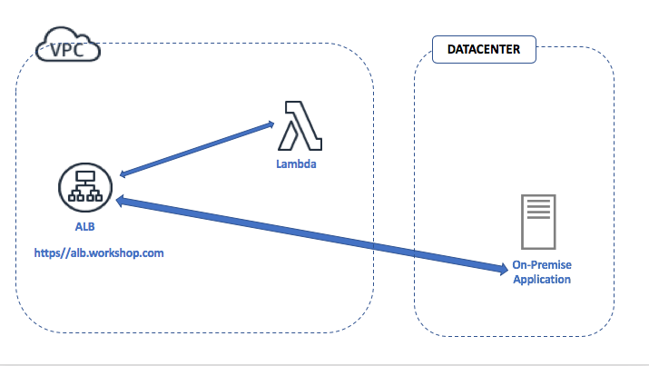

## ACM Private Certificate authority - Generating and using private certificate for a private domain

This workshop demonstrates how ACM Private Certificate authority(PCA) can be created and made operational. It then helps you learn
about how ACM PCA can be used to generate private certificates for a private domain so that the private domai can be access over
a HTTPS connection

## Let's look at some concepts and the architecture diagram:

 

### Cloudformation templates for the setting up architecture for this usecase

Please run the below cloudformation stack in your AWS account

### Step 1 :

The above stack creates the necessary services to build out the AWS architecture shown above 

## Let's do some private cert generaton with AWS Certificate Manager(ACM) private certificate authority(PCA) :

Open the Cloud9 IDE environment called **workshop-environment**. Within the Cloud9 IDE open the bash terminal and use the following command to checkout code for this usecase :

**git checkout acm-pca-usecase-6**

Once you run the command above you will see a folder called **usecase-6** in the Cloud9 environment. Follow the below steps:

### Step 1 :

Run the python module named ***usecase-6-step-1.py***

* First you will see **"Pending DynamoDB table creation for storing shared variables"** printed on the runner window pane below
* Wait for about 45 seconds 
* You should see the following printed in the runner window pane below

**"shared_variables_crypto_builders DynamoDB table created"** 
**"Lambda targets for the ALB successfully registered"**

This module will create a DynamoDB table called **shared_variables_crypto_builders** . The primary purpose of this table is to share variables
across the different python modules that we will run in this usecase. The lambda function that was created in the CF template is registered as
a target for the Application load balancer

### Step 2 :

Run the python module named ***usecase-6-step-2.py***

* This module creates a ACM private certificate authority with the common name **acmpcausecase6.subordinate**
* This private certificate authority will publish certificate revocation lists within a S3 bucket whose name
  starts with **builder-acm-pca-usecase-6-bucket-pca-crl**
* You should see the following printed in the runner window pane
    * "Private CA has been created"
    * "Please generate the CSR and get it signed by your organizations's root cert"
    * "Success : The ARN of the subordinate private certificate authority is : "
       arn:aws:acm-pca:<region>:<your-acccount-number>:certificate-authority/57943599-30d2-8723-1234-1cb4b7d81128
* In the AWS console browse to the AWS Certificate Manager service(ACM) . Under Private CA's you will see the private CA created and
  the status should show "Pending Certificate"

 

**Some questions to think about :**

* Why is the status of the private CA showing "Pending Certificate" ?
* Is the private certificate authority that's created a root CA or a subordinate CA ?
* What's the purpose of the S3 bucket storing certificate revocation lists ?

### Step 3 :

Run the python module named ***usecase-6-step-3.py***

* This module creates a self signed root certificate with the common name **rootca-reinvent-builder**
* You can see in the code that the private key associated with the self signed cert is stored in an encrypted DynamoDB table.
  This is purely for demonstration purposes. In your organization you should store it in an HSM or a secure vault
* You should see the following printed in the runner window pane below 
   * Success - Self signed certificate file ***self-signed-cert.pem*** created"
   * "This self signed certificate will be used in the certificate chain of trust"
 
 

**Some questions to think about :**

* In your organization would you use the root cert to sign subordinate CA's ?
* Why is it necessary to store the private keys of root certs in an HSM ?
* What would happen if the private key of the root cert gets compromised or stolen ?

### Step 4 :

Run the python module named ***usecase-6-step-4.py***

* This module gets a Certificate signing request(CSR) for the private certifiate authority with 
  common name **acmpcausecase6.subordinate** that was created in **Step 2**
* The certificate signing request is signed using the self signed certificate and it's private key 
  that was created in **Step 3** 
* The signed cert is stored in a pem file called ***signed_subordinate_ca_cert.pem***
* You should see the following printed in the runner window pane below 
   * Successfully created signed subordinate CA pem file ***signed_subordinate_ca_cert.pem*** 

### Step 5 :

Run the python module named ***usecase-6-step-5.py***

* This module imports the subordinate CA signed certificate ***signed_subordinate_ca_cert.pem*** and 
  certificate chain of trust into AWS Certificate Manager(ACM)
* The certificate chain contains the self signed CA certificate that we created in **Step 3**
* After this operation the subordinate privcate certificate authority(CA) changes status to ACTIVE. 
* Browse to the ACM service within the AWS console and you should see the status of the subordiate CA with 
  common name **acmpcausecase6.subordinate** as ACTIVE as shown below
* We are at a point where the subordinate private certificate authority(PCA) can issue private certificates
  for any endpoint, device or server
* You should see the following printed in the runner window pane below 
   * Successfully imported signed cert and certificate chain into ACM

 

### Step 6 :

**Time : 1 minute**

Run the python module named ***usecase-6-step-6.py***

* This module takes about 1 minute to complete 
* This module uses the ACM Private certificate authority(PCA) to generate a certificate for the private domain
  alb.workshop.com. You cannot access this domain from the public internet.
* The certificate chain of trust required for trusting the private domain alb.workshop.com is created
  and written into the local file ***cert_chain.pem***
* An HTTPS listener is attached to the application load balancer and this listener is associated with the private certificate issued for the domain alb.workshop.com
* After these steps alb.workshop.com is ready to server content
* You should see the following printed in the runner window pane below :

**"Successfully attached a HTTPS listener to the ALB"**
**"Subordinate PCA reinvent.builder.subordinate successfully issued a private certificate for the private domain alb.workshop.com"**

### Step 7 :

Run the python module named ***usecase-5-step-7.py***

* This module uses the below curl command to do a HTTPS GET on the private domain alb.workshop.com that's fronted 
  by an application load balancer with an HTTPS listener   

  curl --verbose -X GET https://alb.workshop.com/
  
* We are using the curl command to simulate a HTTPS web client 

* Since the curl commmand does not supply the certificate trust chain as a parameter the HTTPS connection is going to
  complain that the server certificate is not recognized. You will see the following printed in the runner window
  pane below if you look through the printed log 

  ** curl: (60) Peer's Certificate issuer is not recognized **
  ** Certificate is not trusted - cannot validate server certificate **

**Some questions to think about :**

* Why was the server certificate from alb.workshop.com not recognized by the curl command ? 
* What potential automation you might need within your organization to use these private certificates at scale ?

### Step 8 :

Run the python module named **usecase-6-step-8.py**

* This module uses the below curl command to do a HTTPS GET on the private domain alb.workshop.com that's fronted 
  by an application load balancer with an HTTPS listener  

  curl --verbose --cacert cert_chain.pem -X GET alb.workshop.com
  
* Since the curl command has the chain of trust pem file as a parameter the private domain cert for 
  alb.workshop is trusted and successfully authenticated. You should see the following printed in the 
  runner window pane.
  
  **Hello World!**
  
  **Certificate is trusted and is valid**

### Step 9 :

Run the python module named ***usecase-6-step-9-cleanup.py***

This is the step for cleaning up all the resources that were created for the **acm-pca-usecase-6**

* This module cleans up all the local files, S3 buckets, target groups and listeners that was created in the python modules for this usecase.
* You should see the following printed in the runner window pane.

**"\nEverything cleaned up ,you are all good !!"**

  