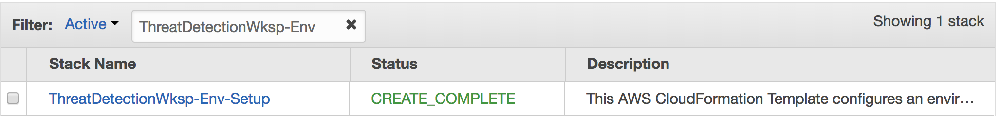
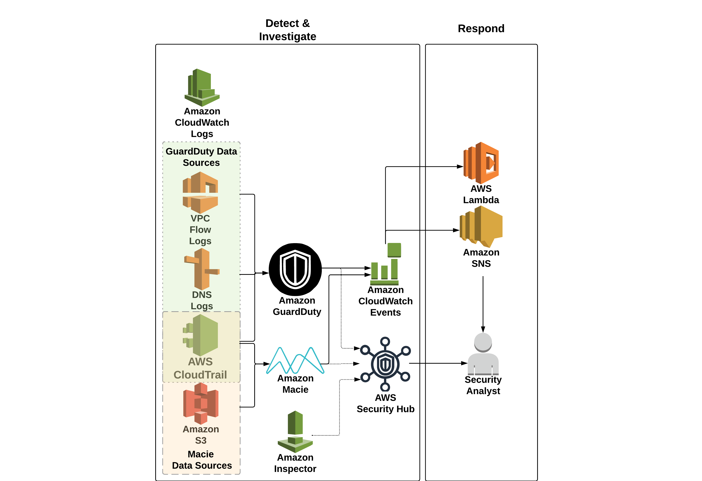

# Module 1: Environment build and configuration

In the first module you will be configuring detective and responsive controls for your environment.  You'll be running the first of two CloudFormation templates which will automate the creation of some of these controls and then you will manually configure the rest.

## Deploy the AWS CloudFormation template

To initiate the scenario and configure your environment you will need to run the module 1 CloudFormation template: 

!!! info "Before you deploy the CloudFormation template feel free to view it <a href="https://github.com/aws-samples/aws-scaling-threat-detection-workshop/blob/master/templates/01-environment-setup.yml" target="_blank">here</a href>."

Region| Deploy
------|-----
US West 2 (Oregon) | <a href="https://console.aws.amazon.com/cloudformation/home?region=us-west-2#/stacks/new?stackName=ThreatDetectionWksp-Env-Setup&templateURL=https://s3-us-west-2.amazonaws.com/sa-security-specialist-workshops-us-west-2/threat-detect-workshop/staging/01-environment-setup.yml" target="_blank"></a>

1. Click the **Deploy to AWS** button above.  This will automatically take you to the console to run the template.  

2. On the **Specify Details** section enter the necessary parameters as shown below. 

	| Parameter | Value  |
	|---|---|
	| Stack name | ThreatDetectionWksp-Env-Setup  |
	| Email Address | A ***valid*** email address  |
	
3. Once you have entered your parameters click **Next**, then **Next** again \(leave everything on this page at the default\).

4. Finally, acknowledge that the template will create IAM roles and click **Create**.


This will bring you back to the CloudFormation console. You can refresh the page to see the stack starting to create. Before moving on, make sure the stack is in a **CREATE_COMPLETE** status as shown below.



You will get an email from SNS asking you to confirm the Subscription. **Confirm the subscription** so you can receive email alerts from AWS services during the Workshop.

## Setup Amazon CloudWatch event rules and automatic response

The CloudFormation template you just ran created three <a href="https://docs.aws.amazon.com/AmazonCloudWatch/latest/events/WhatIsCloudWatchEvents.html" target="_blank">CloudWatch Event Rules</a> for alerting and response purposes. The steps below will walk you through creating the final rule.  After this you'll have rules in place to receive email notifications and trigger AWS Lambda functions to respond to threats.

Below are steps to create this rule through the console but you can also find out more about doing it programmatically by reviewing the <a href="http://docs.aws.amazon.com/guardduty/latest/ug/guardduty_findings_cloudwatch.html" target="_blank">Amazon GuardDuty Documentation</a>.

1.	Open the <a href="https://us-west-2.console.aws.amazon.com/cloudwatch/home?region=us-west-2" target="_blank">CloudWatch console</a> (us-west-2)
2.	In the navigation pane on the left, under **Events**, click **Rules**

	!!! question "What are the current Rules in place setup to do?"
	
3.	Click **Create Rule**

4.	Under **Event Pattern** click **Build event pattern to match events by service** and select **Custom event pattern** in the drop down.
Copy and paste in the custom event pattern below:
	
```json
{
  "source": [
	"aws.guardduty"
  ],
  "detail": {
	"type": [
	  "UnauthorizedAccess:EC2/MaliciousIPCaller.Custom"
	]
  }
}
```
	
For *Targets*, click **Add Target**, select **Lambda Function**, and then select **threat-detection-wksp-remediation-nacl**. Click **Configure details**.

5.	On the **Configure rule details** screen fill out the **Name** and **Description** (suggestions below).
    * Name: **threat-detection-wksp-guardduty-finding-ec2-maliciousip**
    * Description: **GuardDuty Finding: UnauthorizedAccess:EC2/MaliciousIPCaller.Custom**
6. Click **Create rule**.
7.	**Optional:** Consider examining the Lambda function to see what it does.  Open the <a href="https://us-west-2.console.aws.amazon.com/lambda/home?region=us-west-2" target="_blank">Lambda console</a>. Click on the function named **threat-detection-wksp-remediation-nacl**

    !!! question "What will the function do when invoked?"

## Enable Amazon GuardDuty

The next step is to enable Amazon GuardDuty, which will continuously monitor your environment for malicious or unauthorized behavior.

1.	Go to the <a href="https://us-west-2.console.aws.amazon.com/guardduty/home?region=us-west-2" target="_blank">Amazon GuardDuty</a> console (us-west-2).

2.	Click the **Get Started** button.

3.	On the next screen click the **Enable GuardDuty** button.

GuardDuty is now enabled and continuously monitoring your CloudTrail logs, VPC flow logs, and DNS Query logs for threats in your environment.

## Enable Amazon Macie

Since you plan on storing sensitive data in S3, let’s quickly enable Amazon Macie.  Macie is a security service that will continuously monitor data access activity for anomalies and generate alerts when it detects risk of unauthorized access or inadvertent data leaks.

1.	Go to the <a href="https://us-west-2.redirection.macie.aws.amazon.com/" target="_blank">Amazon Macie</a> console (us-west-2).

2.	Click **Get Started**.

3.	Macie will create a service-linked role when you enable it. If you would like to see the permissions that the role will have you can click the **View service role permissions**.

4.	Click **Enable Macie**.

## Setup Amazon Macie for data discovery & classification

Macie is also used for automatically discovering and classifying sensitive data.  Now that Macie is enabled, setup an integration to classify data in your S3 bucket.

1.	In the Amazon Macie console click on **Integrations** on the left navigation.

3.	Find your AWS account ID (there should be only one) and click **Select** 

4.	Click **Add** then on the next screen click the check box next to the S3 bucket that ends with **“-data”**. Click **Add**

5. Leave the options here at the default, click **Review**.

6. On the next screen click **Start Classification**. 

6. Finally click **Done**. Macie is now enabled and has begun to discover, classify and protect your data.

## Enable AWS Security Hub

Now that all of your detective controls have been configured you need to enable <a href="https://aws.amazon.com/security-hub/" target="_blank">AWS Security Hub</a>, which will provide you with a comprehensive view of the security and compliance of your AWS environment.

1.	Go to the <a href="https://us-west-2.console.aws.amazon.com/securityhub/home?region=us-west-2#" target="_blank">AWS Security Hub</a> console.

2.	Click the **Enable Security Hub** button.

3.	On the next screen click the **Enable AWS Security Hub** button.

AWS Security Hub is now enabled and will begin collecting and aggregating findings from the security services we have enabled so far.

## Architecture overview

Your environment is now configured and ready for operations.  Below is a diagram to depict the detective controls you now have in place.



After you have successfully setup your environment, you can proceed to the next module.
