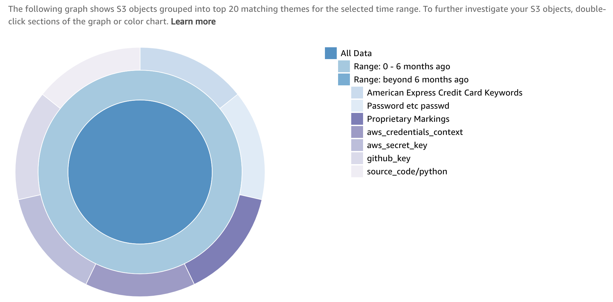
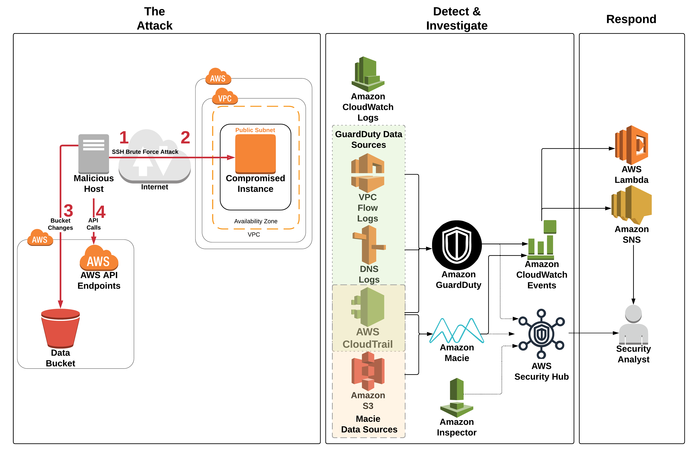

<!--
Outline for 03-detection-and-remediation.md
# Module 3: Detect, Investigate & Respond

## Part 1 - Compromised AWS IAM credentials
### Detect and Investigate
#### Explore findings related to the access key (securityhub)
### Respond
#### Revoke the IAM role sessions (IAM)
#### Restart instance to rotate access keys (EC2)
#### Verify the the access keys have been rotated (Systems Manager)

## Part 2 - Compromised EC2 Instance
### Detect and Investigate 
#### Explore findings related to the instance ID (securityhub)
#### Determine if ssh password authentication is enabled (securityhub)
#### Determine if the attacker was able to login to the EC2 instance (CloudWatch logs)
### Respond
#### Modify the EC2 security group (EC2)

## Part 3 - Compromised S3 security
### Detect and Investigate 
#### Investigate any S3 related findings (securityhub)
#### Check if sensitive data was involved (Macie)
### Respond
#### Fix the S3 data bucket permissions and encryption (S3)

# Link to next module
--> 

# Module 3: Detect, Investigate & Respond

Unfortunately, due to a misconfiguration in your environment, an attacker may have been able to gain access to the web server. You are getting alerts from the security services you’ve put in place indicating malicious activity. These alerts include communication with known malicious IP addresses, account reconnaissance, changes to an Amazon S3 bucket configuration, and disabling security configurations. You must identify what activity the intruder may have performed and how they did it so you can block the intruder’s access, remediate the vulnerabilities, and restore the configuration to its proper state.

## Part 1 - Compromised AWS IAM credentials

### Detect and investigate 

By now you’ve received email alerts from the security services you enabled. Now what? As part of your risk driven detection strategy your organization has decided to prioritize AWS IAM related findings.  

1. Sort through your email alerts and identity an alert related to an AWS IAM principal (e.g. *Amazon GuardDuty Finding: UnauthorizedAccess:IAMUser/MaliciousIPCaller.Custom*).
2. Copy the **`Access Key ID`** from the e-mail alert. 

**Explore findings related to the access key (Amazon GuardDuty)**

Now that you have a resource identifier to go off of you can use Amazon GuardDuty to start doing some investigation into the findings.

1. Go to the <a href="https://us-west-2.console.aws.amazon.com/guardduty/" target="_blank">Amazon GuardDuty</a> console (us-west-2).

2. Click in the **Add filter criteria** box, select **Access Key ID**, and then paste in the `<Access Key ID>` you copied from the e-mail. 

    !!! question "What findings do you see related to this Access Key ID?"
	
3. Click on one of the findings to see the details.

	!!! question "What principal are these credentials associated with?"

Examining **User type** under **Resource affected** you can see that the access key referenced in this finding is from an IAM assumed role. Examining **Principal ID** under **Resource affected** you will find two strings separated by a colon. The first is the <a href="https://docs.aws.amazon.com/IAM/latest/UserGuide/reference_identifiers.html#identifiers-unique-ids" target="_blank">unique ID</a> for the IAM role and the second is the EC2 instance ID. The **Principal ID** contains a unique ID for the entity making the API request, and when the request is made using temporary security credentials (which is what happens for an assume role call) it also includes a session name. In this case the session name is the EC2 instance ID since the assume role call was done using an IAM role for EC2.

5. Copy the full **Principal Id** which contains both the unique ID of the role and the session name: **"principalId": "`< unique ID >:< session name >`"**

6. Examine the **User name** under **Resource affected** and copy it down. This corresponds to the name of the IAM role involved since the temp creds used to make the API call came from EC2 instance with an IAM role attached. 

<!--

To use SH for this we could use the insight "AWS users with the most suspicious activity" but that would be a stretch - no way to take this and figure out an IAM role is involved just by using the SH console.


1. Go to the [AWS Security Hub](https://us-west-2.console.aws.amazon.com/securityhub/home?region=us-west-2#/investigate) console.
2. The link should take you to the **Investigate** section but if not, click on **Investigate** in the navigation on the left.
3. Click in the **Add filter** box:

	* Scroll down to **Resource ID**, change the operator to **CONTAINS** and paste in the `<Access Key ID>` you copied from the e-mail. 

	>  What findings do you see related to this access key ID?
	
4. Click on one of the findings to see the details.

	> Where did these credentials come from? 

Examining **userType** under **Resource details**/**Details** you can see that the access key referenced in this finding is from an IAM assumed role. Examining **principalID** under **Details** you will find two strings separated by a colon. The first is the [unique ID](https://docs.aws.amazon.com/IAM/latest/UserGuide/reference_identifiers.html#identifiers-unique-ids) for the role and the second is the EC2 instance ID. The **principalID** contains a unique ID for the entity making the API request, and when the request is made using temporary security credentials (which is what happens for an assume role call) it also includes a session name. In this case the session name is the EC2 instance ID  since the assume role call was done using an IAM role for EC2.

5. Copy the full **principalId** which contains both the unique ID of the role and the session name
	* **"principalId": "`< unique ID >:< session name >`"**

6. Click **Cancel** (upper right-hand corner) to return back to the findings and paste only the **unique ID** into the filter:
	* **Keyword: `<unique ID>`**

Filtering on the access key ID like you did previously earlier will only show you findings related to that specific access key.  In this case the access key is from an assumed role call which means it will change over time.  Rather than using the access key id you can filter on the unique ID for the AWS IAM role which will show you all findings related to any access keys generated by that AWS IAM role.
	
7. After you have applied the filter check all the checkboxes for the findings, click **Actions**, and set active status to **In Progress** (since we are actively investigating this.)

8. Click **Create Insight** so you can further track findings related to this IAM principal.  Enter the following into insight name **`Show me findings related to <Unique ID>`** and toggle the **Display on insights page** so it is enabled and click **Ok**

-->

### Respond

Now that you have identified that a temporary security credential from an IAM role for EC2 is being used by an attacker, the decision has been made to rotate the credential immediately to prevent any further misuse or potential privilege escalation.
  
**Revoke the IAM role sessions (IAM)**

1.  Browse to the <a href="https://console.aws.amazon.com/iam/home?region=us-west-2" target="_blank">AWS IAM</a> console.

2.  Click **Roles** and find the role you identified in the previous section using the **User Name** you copied down earlier (this is the role attached to the compromised instance).

3.  Click on the **Revoke sessions** tab.

4.  Click on **Revoke active sessions**.

5.  Click the acknowledgement **check box** and then click **Revoke active sessions**. 

    !!! question "What is the mechanism that is put in place by this step to actually prevent the use of the temporary security credentials issued by this role?"

**Restart the EC2 instance to rotate the access keys (EC2)**

All active credentials for the compromised IAM role have been invalidated.  This means the attacker can no longer use those access keys, but it also means that any applications that use this role can't as well.  You knew this going in but decided it was necessary due to the high risk of a compromised IAM access key. In order to ensure the availability of your application you need to refresh the access keys on the instance by stopping and starting the instance. *A simple reboot will not change the keys.* If you waited the temporary security credential on the instance would be refreshed but this procedure will speed things up. Since you are using AWS Systems Manager for doing administration on your EC2 Instances you can use it to query the metadata to validate that the access keys were rotated after the instance restart.

6. In the <a href="https://us-west-2.console.aws.amazon.com/ec2/v2/home?region=us-west-2#Instances:sort=instanceId" target="_blank">EC2 console</a> **Stop** the Instance named **threat-detection-wksp: Compromised Instance**.
7. Wait for the Instance State to say **stopped** under **Instance State** (you may need to refresh the EC2 console) and then **Start** the instance.

    !!! info "You will need to wait until all Status Checks have passed before continuing."

**Verify the access keys have been rotated (Systems Manager)**

8.  Go to <a href="https://us-west-2.console.aws.amazon.com/systems-manager/managed-instances?region=us-west-2" target="_blank">AWS Systems Manager</a> console and click on **Session Manager** on the left navigation and then click **Start Session**.  

    You should see an instance named **threat-detection-wksp: Compromised Instance** with a **Instance state** of **running**.
    
9.  To see the credentials currently active on the instance, click on the radio button next to **threat-detection-wksp: Compromised Instance** and click **Start Session**.

11.	Run the following command in the shell and compare the access key ID to the one found in the email alerts to ensure it has changed:
	
``` bash
curl http://169.254.169.254/latest/meta-data/iam/security-credentials/threat-detection-wksp-compromised-ec2
```

!!! question "Why would this scenario be a good use case for auto-scaling groups?" 

At this point you've successfully revoked all the active sessions from AWS IAM role and rotated the temporary security credentials on the EC2 instance.

<!--
, and created an AWS Security Hub insight to allow you to continue to track findings related to the role.  You can view the insight you created by clicking on **Security Hub default** in the AWS Security Hub console.
-->

## Part 2 - Compromised EC2 instance

### Detect and investigate 

Now that you've addressed the compromised IAM credential you need focus in on how the attacker was able to compromise the EC2 instance. It's this compromise which allowed them to query the instance metadata and steal the credentials.

**Explore findings related to the instance ID (AWS Security Hub)**

When investigating the compromised IAM credential you discovered that it was from an IAM role for EC2 and identified the EC2 instance ID from the principal ID of the finding. Using the instance ID you can use AWS Security Hub to start investigating the findings.  To start, you are going to research the GuardDuty findings related to the EC2 instance.

1. Go to the <a href="https://us-west-2.console.aws.amazon.com/securityhub/home?region=us-west-2#/findings" target="_blank">AWS Security Hub</a> console.
2. The link should take you to the **Findings** section (if not, click on **Findings** in the navigation on the left).
3. Click in the **Add filter** box:

	* Scroll down to **Resource ID**, change the operator to **CONTAINS** and paste in the `<Instance ID>` you copied earlier (from the principal ID you gathered in the GuardDuty finding). 
	* Add another filter by again clicking in the **Add filter** box and scrolling down to **Product Name**, and paste in the word `GuardDuty`.

	!!! question "What GuardDuty findings do you see related to this instance ID?"

<!--
1. Go to the [AWS Security Hub](https://us-west-2.console.aws.amazon.com/securityhub/home?region=us-west-2) console.
2. On the left navigation, click on **Explore Findings**
3. Add the following filter:
	* **Keyword: `instance id`** (you obtained the instance ID earlier from the principal ID in one of the findings. The instance ID came from the session name of the principal ID.)
	* **Provider: GuardDuty**

	>  What findings do you see related to this Instance ID?
-->
One of the findings should indicate that the EC2 instance is communicating with an IP address on a threat list (**disallowed IP**) which adds further evidence to the conclusion that the instance has been compromised. The other finding should indicate that a system at a particular IP address is performing an SSH brute force attack against your instance.  You now need to investigate if the SSH brute force attack was successful and if that is what allowed the attacker to gain access to the instance.

**Determine if ssh password authentication is enabled on the EC2 instance (AWS Security Hub)**

Automated responses to threats can do many things. For example, you could have an trigger that helps gather information about the threat that could then be used in the investigation by the security team. With that option in mind, we have a CloudWatch event rule in place that will trigger an <a href="https://aws.amazon.com/inspector/" target="_blank">Amazon Inspector</a> scan of an EC2 instance when GuardDuty detects a particular attack. We will use AWS Security Hub to view the findings from Inspector. We want to determine if the SSH configuration adheres to best practices. 

1. Go to the <a href="https://us-west-2.console.aws.amazon.com/securityhub/home?region=us-west-2#/findings" target="_blank">AWS Security Hub</a> console.
2. The link should take you to the **Findings** section (if not, click on **Findings** in the navigation on the left). Click in the **Add filter** box:

	* Scroll down to **Title**, change the operator to **CONTAINS** and paste in `password authentication over SSH`. 

In the results you will see a finding regarding SSH and password authentication for the instance that experienced the SSH brute force attack. 

<!--
1. Go to [AWS Security Hub](https://us-west-2.console.aws.amazon.com/securityhub/) in the AWS Management Console.
2. On the left navigation, click on **Explore Findings**
3. Add the following filter:
	* **Keyword: `password authentication over SSH`** 
	* **Provider: Inspector**
4. In the results do you see a finding regarding SSH and password authentication for the instance that experienced the SSH brute force attack? 
-->

!!! info "If you do not see any findings after awhile, there may have been an issue with your Inspector agent.  Go to the <a href="https://us-west-2.console.aws.amazon.com/inspector" target="_blank">Inspector</a> console, click on **Assessment Templates**, check the template that starts with **threat-detection-wksp**, and click **Run**.  Please allow **15 minutes** for the scan to complete.  You can also look in **Assessment runs** and check the **status**. Feel free to continue through this module and check the results later on." 

Based on the findings you should see that password authentication over SSH is configured on the instance. In addition, if you examine some of the other Inspector findings you will see that there are no password complexity restrictions. This means the instance is more susceptible to an SSH brute force attack. 

<!--
2.  Click on **securityhub default** under **Insight Groups**
3. Click **Manage** (in the upper right hand corner of the dashboard) and then click **Define Insight**
4.  We will now define the filters for the insight. Under "Findings" select **Provider** from the pull down menu. Next to that select **Inspector**. This will add **Provider: Inspector** to the filters. Next select **Keyword** from the pull down menu under findings (it should already be the default.) Next to that enter the following text `password authentication over SSH` then hit enter. You will have added a keyword filter. 
5. Click **Create insight** so we can save this insight for future use. Enter the following into insight name **`Instances allowing password authentication over SSH`** and toggle the **Display on insights page** so it is enabled then finally click **Ok**.
-->

**Determine if the attacker was able to login to the EC2 instance (CloudWatch logs)**

Now that we know that the instance was more susceptible to an SSH brute force attack, let’s look at the CloudWatch logs and create a metric to see if there were any successful SSH logins (to finally answer the question of whether the SSH brute force attack was successful.) Your corporate policy is to send security certain logs from EC2 instances to CloudWatch. 

1.  Go to <a href="https://us-west-2.console.aws.amazon.com/cloudwatch/home?region=us-west-2#logs:" target="_blank">CloudWatch logs</a>.
2.  Click on the log group **/threat-detection-wksp/var/log/secure**
3.  If you have multiple log streams, filter using the Instance ID you copied earlier and click on the stream.
4.  Within the **Filter Events** text box put the following Filter Pattern: **`[Mon, day, timestamp, ip, id, msg1= Invalid, msg2 = user, ...]`**

    !!! question "Do you see any failed (invalid user) attempts to log into the instance? Would that be consistent with an SSH brute force attack?"
    
5.  Now replace the Filter with one for successful attempts: **`[Mon, day, timestamp, ip, id, msg1= Accepted, msg2 = password, ...]`**

    !!! question "Do you see any successful attempts to log into the instance? Which linux user was compromised?"
    
### Respond

**Modify the EC2 security group (EC2)**

The active session from the attacker was automatically stopped by an update to the NACL on the subnet where the instance resides. This was done by a CloudWatch event rule trigger that is invoked based on certain GuardDuty findings. You've decided that all administration on EC2 Instances will be done through <a href="https://aws.amazon.com/systems-manager/" target="_blank">AWS Systems Manager</a> so you no longer need administrative ports open so a good next step would be to modify the security group associated with the EC2 instance to prevent the attacker or anyone else from connecting.

1.  Go to the <a href="https://us-west-2.console.aws.amazon.com/ec2/v2/home?region=us-west-2" target="_blank">Amazon EC2</a> Console.

2.  Find the running instances with the name **threat-detection-wksp: Compromised Instance**.

3.  Under the **Description** tab, click on the Security Group for the compromised instance.

4.  View the rules under the **Inbound** tab.

5.  Click **Edit** and delete the inbound SSH rule.

    !!! info "The SSM Agent was installed on your EC2 Instance during the initial configuration."
    
6. Click **Save**


## Part 3 - Compromised S3 bucket

### Detect and investigate 

Now that we know the SSH brute force attack was successful and we disabled the IAM credentials that were stolen, we need to determine if anything else occurred. One step we could take here is to examine the IAM policy attached the IAM role that generated the temp credentials. We notice in the policy that there are permissions relating to the Amazon S3 service so that is something to keep in mind as you continue the investigation. 

Here is a truncated view of the policy from the IAM role attached to the compromised EC2 instance:

```json
{
    "Version": "2012-10-17",
    "Statement": [
        {
            "Action": "s3:PutObject",
            "Resource": "arn:aws:s3:::threat-detection-wksp-ACCOUNT_ID-us-west-2-gd-threatlist/*",
            "Effect": "Allow"
        },
        {
            "Action": [
                "s3:*"
            ],
            "Resource": "arn:aws:s3:::threat-detection-wksp-ACCOUNT_ID-us-west-2-data/*",
            "Effect": "Allow"
        },
        {
            "Action": [
                "s3:*"
            ],
            "Resource": "arn:aws:s3:::threat-detection-wksp-ACCOUNT_ID-us-west-2-data",
            "Effect": "Allow"
        }
    ]
}
```

**Investigate any S3 related findings (AWS Security Hub)**

There are many ways to approach this next step. We are going to start with a Security Hub insight that may be helpful in situations like this. This is not the only way you could approach this but it can definitely save time initially as you investigate the full repercussions of an attack.

1. Go to <a href="https://us-west-2.console.aws.amazon.com/securityhub/home?region=us-west-2#/insights" target="_blank">AWS Security Hub</a> in the AWS Management Console.
2. The link should take you to the **Insights** section (if not, click on ** Insights** in the navigation on the left).
3. Click in the **Filter insights** box and type **`Top S3`** which will display the built in Insight "Top S3 buckets by counts of findings." Click on that Insight. 
4. There should be one that with **threat-detection-wksp-** and ends in **-data**. Click on that. 
5. Evaluate the Macie findings shown under the Insight.

This **Security Hub** Insight is one way of determining what an attacker may have done. It is not going to help in every situation though. 
 
**Check if sensitive data was involved (Macie)**

At this point you know how the attacker was able to get into your systems and a general idea of what they did. In the previous step you  determined that the S3 bucket that starts with **threat-detection-wksp-** and ends in **-data** has an ACL that grants global read rights. We will now check if there is any sensitive and business-critical data in the bucket and take a closer at the Macie Alerts.

1. Go to the <a href="https://mt.us-west-2.macie.aws.amazon.com/" target="_blank">Amazon Macie</a> in the AWS Management console.

2.  Click **Dashboard** on the left navigation.  You should see the following data classifications:
    

    !!! info "You can slide the risk slider to filter data classifications based on risk levels."

3. Above the risk slider, click the icon for **S3 public objects and buckets**. The icon will be in the shape of a globe but you can also hover over the icons to find the right one. 
    

4. Click the magnifying glass to the left of the bucket name listed.
5. Check if any of the data in the bucket is considered a high risk.  Look for the **Object PII priority** field and **Object risk level** field.
    
6.  Verify if any of the data is unencrypted.  Look for the **Object encryption** field. 

    !!! question "Does a portion of the blue bar indicate that encryption is set to none?."
    
### Respond

**Fix the permissions and encryption on the bucket (S3)**

In the previous step we determined that the S3 bucket that starts with **threat-detection-wksp-** and ends in **-data** has sensitive data and some of that data is unencrypted. We also know that the bucket grants global read rights. We need to manually fix these issues. 

1. First we will fix the permissions.  Go to <a href="https://us-west-2.console.aws.amazon.com/s3/" target="_blank">Amazon S3</a> in the AWS Management Console. 	
3. Find the bucket that starts with **threat-detection-wksp-** and ends in **-data**
4. Click on the **Permissions** tab then click on **ACL Control List**
5. Under **Public access** click on the radio button next to **Everyone**. Uncheck **List objects** then click **Save**.
7. Now we need to fix the encryption.  In the same bucket, click on the **Properties** tab then click on **Default encryption**
8. Set the encryption to AWS-KMS. Select the **aws/s3** key. Finally click **Save**.

    !!! info "What impact does enabling default encryption have on existing objects in the bucket?"
 
Congratulations! You have successfully remediated the incident and further hardened your environment. This is obviously a simulation and we can not cover every aspect of the response function in the short time allotted but hopefully this gave you an idea of the capabilities available on AWS to detect, investigate and respond to threats and attacks. 

---

Here is a diagram of the attack you just investigated. Numbers 1 & 2 show the SSH brute force attack and successful SSH login. Number 3 shows the S3 bucket changes the attacker made. Number 4 shows the API calls the attacker made with the IAM temporary credentials stolen from the compromised EC2 instance. 


!!! warning "If you are going through this workshop in a classroom setting then the instructor should start the module 4 presentation soon."

