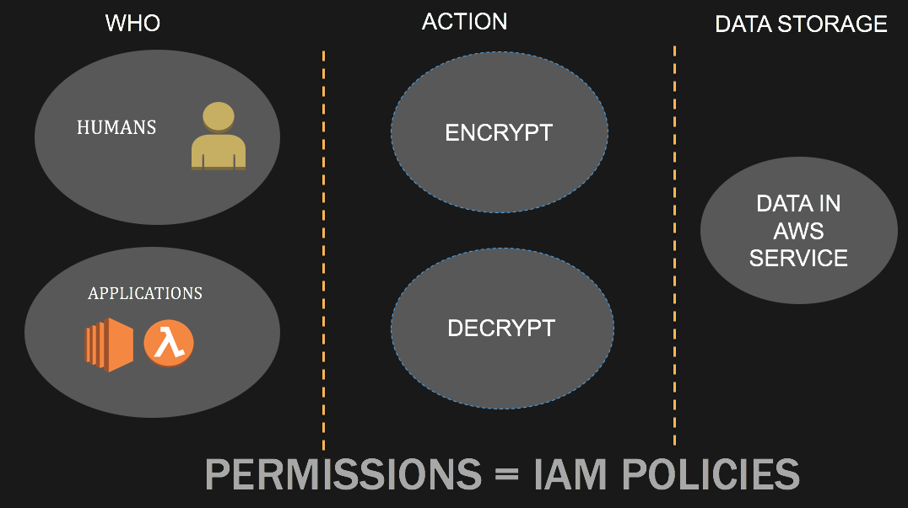
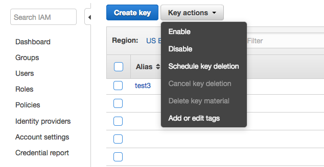

## Key access control  

This workshop demonstrates access control to AWS KMS encryption keys. 

## Let's look at some concepts on AWS KMS key access control:

 

## AWS KMS Key Access Control

Open the Cloud9 IDE environment called **workshop-environment**. Within the Cloud9 IDE open the bash terminal in the runner window below 
and use the following command to checkout code for this usecase :

**git checkout key-access-control-usecase-2**

Once you run the command above you will see a folder called **usecase-2** in the Cloud9 environment. Follow the below steps:

### Step 1 :

Run the module named **kms_key_creation.py**

* This module will create a KMS master key with the key alias **kms_key_key_access_control_usecase_2'** . In the following steps we will refer to this
master key using the alias.
* Logon to the AWS console and see if this key with alias **kms_key_key_access_control_usecase_2** is created

** Before going to Step 2 ,let's try and answer this question :

Do you think that the python module **kms_scheduled_key_deletion.py** can schedule the AWS KMS master key **kms_key_key_access_control_usecase_2'**
for deletion ?

### Step 2 :

* Select this key and try to schedule it for deletion by using the key actions pull down menu as shown in the picture below

 

### Step 3 : 

* Run the module **kms_scheduled_key_deletion.py** and find out if the KMS key with alias **kms_key_key_access_control_usecase_2'** has been 
  indeed scheduled for deletion. You can check for this in the AWS console under **Encryption keys** within the IAM service. The status of the 
  key should say **Pending Deletion**

