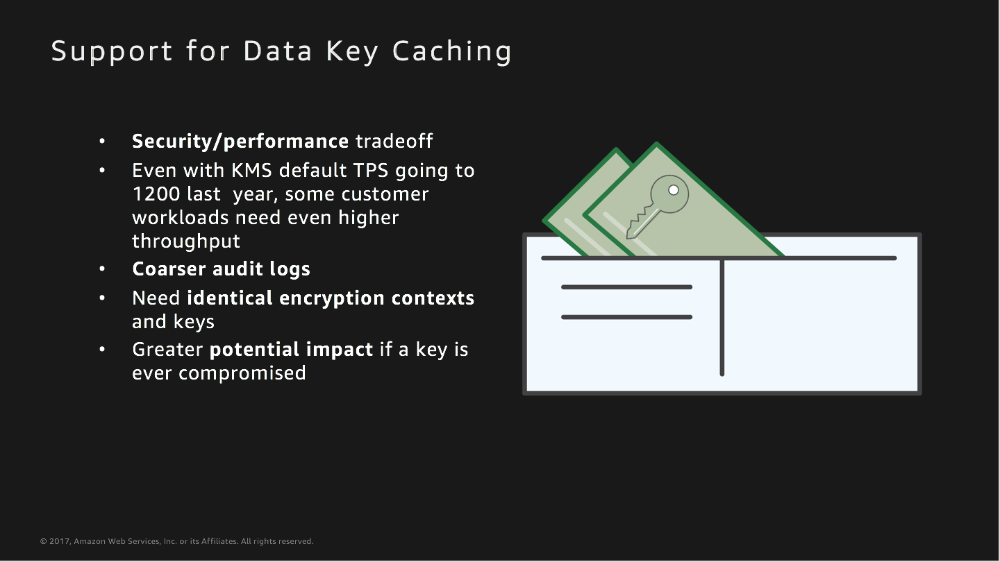

## Client Side Encryption

This workshop demonstrates client side encryption with data key caching 

## Let's look at some concepts :

 

### Let's setup the Cloudformation stack required for this workshop :

The above stack creates a cloudwatch event rule used for this workshop 

## Let's do some client side encryption with data key caching 

Open the Cloud9 IDE environment called **workshop-environment**. Within the Cloud9 IDE, open the bash terminal and use the following command to checkout code for this usecase :

**git checkout kms-cse-usecase-4**

Once you run the command above you will see a folder called **usecase-4** in the Cloud9 environment. Follow the steps below :

### Step 1 :

* Run the module named **kms_key_creation.py**
* You should see **"KMS Master Key with alias name kms_key_cse_usecase_4 successfully created"** printed
  in the runner window pane below.
* This python module will create a KMS master key with the key alias **kms_key_cse_usecase_4** 

### Step 2 :

* You will find a file called ***plaintext_u.txt*** which is the plaintext unencrypted file.
* Run the **usecase-4.py** python module.
* The module **usecase-4.py** encrypts the ***plaintext_u.txt*** file and produces an encrypted file
  called ***encrypted_e_1.txt***
* The ***plaintext_u.txt*** file is encrypted one more time and an encrypted file called 
  ***encrypted_e_2.txt*** is produced
* You should see **"Module run was successful"** printed in the runner window pane below

### Step 3 :

* The encrypted file ***encrypted_e_1.txt*** is then decrypted and the decrypted file 
  is called ***plaintext_u_cycled_1.txt***
* The encrypted file ***encrypted_e_2.txt*** is then decrypted andthe decrypted file 
  is called ***plaintext_u_cycled_2.txt***

### Step 4 :

* Wait for 2 minutes 
* Run the **check-gendatakey.py** python module
* You should see **"GenerateDataKey API Called"** printed in the runner window pane below
* Even though in **Step 3** two encrypts happened only one **GenerateDataKey API call** was made.
* The reason for this is that the data key that was generated was cached and reused for the second encrypt call 
* Open up **usecase-4.py** and take a look at both the encrypt calls in the code 

### Step 5 :

* Run **usecase-4-cleanup.py** python module 
* You should see **Cleanup Successful** printed in the runner window pane below
* This modules deletes the kms key and it's alias that we created in **kms_key_creation.py**
  .It also deletes all the files that were created as part of the module run in the **usecase-4** folder
* Please remember that every time you run **usecase-4-cleanup.py** ,if you want to re-run this uecase,
  you will have to start from **Step 1**

### Some questions to think about :

* Why do we wait for 2 minutes in Step 4 ?
