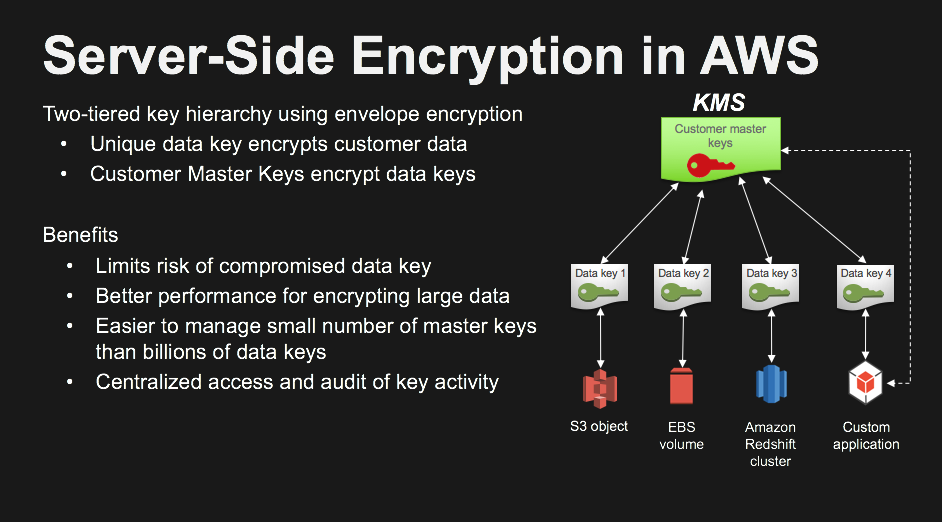

## Server Side Encryption 

# Prerequisites

### AWS Account

If you are participating in this workshop as part of an AWS event, pre-provisioned temporary accounts that are specifically initialized for this workshop might be provided by the organizers. To access your temporary account you will receive a **12-digit hash code** that can be used at the [AWS Event Engine Site](https://dashboard.eventengine.run). You will not need a username and password.

If you wish to participate in this workshop without a pre-provisioned temporary account, please see the [AWS Initialization and tear down](#aws-initialization-tear-down) section below.

### Browser

These workshops assume that you are using the [Cloud9 IDE environment](https://aws.amazon.com/cloud9/). We recommend you use the latest version of Chrome or Firefox to complete this workshop. 

### Knowledge Of Python Programming Language

Basic python knowledge is sufficient to consume these workshops.

# Setup Workshop Environment

* Navigate to the Cloud9 service within your AWS console
* Open the Cloud9 IDE environment called **workshop-environment**. It takes about 30 seconds for the environment to start up.
* In the Cloud9 IDE environment you will find a folder called **data-protection** in the folder pane on the left side of the screen
* Right-click (on MacOS: control-click) the file named **environment-setup.sh**  in the IDE and select **Run**
* This script takes about a minute to complete
* In the runner window below you should see **SUCCESS: installed python dependencies ** followed by a list of the installed packages

# AWS Initialization & tear down

**IMPORTANT!** 
* This section is only relevant if you are **not** using a pre-provisioned account. 
* The resources used in this workshop **will incur charges** in the AWS account used if not torn down according to the procedure outlined below

You can use a **personal account** or create a **new AWS account** to ensure you have the neccessary access. This should not be an AWS account from the company you work for. Please note that creating an AWS account takes time (credit card validation, etc.) and is not recommended when participating in the workshop during a time constrained event.

### Region Support

Since these workshops use the Cloud9 IDE, you can use run these workshops in the following regions where the AWS Cloud9 
service is available : 
* **N.Virginia** (us-east-1)
* **Ohio** (us-east-2)
* **Oregon** (us-west-2)
* **Ireland** (eu-west-1)
* **Singapore** (ap-southeast-1)

### Cloudformation templates for initial environment setup

Please download the [Data Protection Workshop cloudformation stack](cf-templates/template-workshops-setup.yaml) and launch it in your AWS account as this is required for all the workshops in this repository. To launch the stack you must go to the AWS Console and navigate to the CloudFormation service where you can choose **Create Stack** and upload the Cloudformation stack for the workshop. You provide a name for the stack and keep clicking **next** until you get to the point where it says:

```
I acknowledge that AWS CloudFormation might create IAM resources with custom names.
```

Acknowledge the above statement by clicking on the check box and then click on the **Create** button

The above stack creates an Cloud9 IDE environment called **workshop-environment**. 
In addition a VPC with two subnets and an internet gateway is also created.


This workshop demonstrates server side encryption using AWS KMS and S3

## Let's look at some concepts :

<a></a><br>
<a></a><br>

## Let's do some server side encryption

Open the Cloud9 IDE environment called **workshop-environment** and navigate to the **data-protection/usecase-1** directory.
Follow the instructions below:

### 1. Run the module named `kms_key_creation-Step-1.py`

This module will create a KMS master key with the key alias **kms_key_sse_usecase_1** . In the following steps we will refer to this
master key using the alias. Browse to the KMS console and you should find the key alias **kms_key_sse_usecase_1** under 
customer managed keys

### 2. Run the module named `usecase-1-Step-2.py`

This module uploads the ***plaintext_u.txt*** file to an S3 bucket named `dp-workshop-builderXXXX`. 
Before the file is stored on S3 it is server side encrypted using the KMS key alias *kms_key_sse_usecase_1*

### 3. Inspect the encrypted file in S3

In the AWS console, navigate to the S3 service and look for the bucket named `dp-workshop-builderXXXX`.
In the bucket there should be a file called ***encrypted_e.txt***. This file was encrypted using a Data key under the KMS master key **key_sse_usecase_1**. Take a look at the properties of the file ***encrypted_e.txt***. You will find that it's encrypted using AWS-KMS as shown in the picture below:

<a></a><br>

### 4. Compare the decrypted file from S3 with the original

The `usecase-1-Step-2.py` python module does a S3 getobject API Call on ***encrypted_e.txt*** which is decrypted by the S3 service and retrieved over TLS into your Cloud9 environment. In the folder **usecase-1** ,you should see a file called ***plaintext_cycled_u.txt***. Compare its contents to the original file named ***plaintext_u.txt***. 

### 5. Run the module named `usecase-1-cleanup-Step-3.py`

This modules deletes the kms key and it's alias that we created in **kms_key_creation-Step-1.py** and also deletes all the files that were created in the **usecase-1** folder. Please remember that when you run `usecase-1-cleanup-Step-3.py` and you want to re-run this use case, you will have to start from the beginning.

### Tear down Cloudformation stack

After you have completed the workshop, you need to tear down the stack by navigating to the CloudFormation service in the AWS console and selecting the stack name you chose when launching the stack. If you are doing this workshop as
part of a AWS marketing with a pre-provisioned account provided by AWS you don't have to do any teardown

Choose the **delete** action and wait for the process to complete. Note that it can take a few minutes for the stack to clean up its resources.

## License Summary

This sample code is made available under a modified MIT license. See the [LICENSE](LICENSE) file.