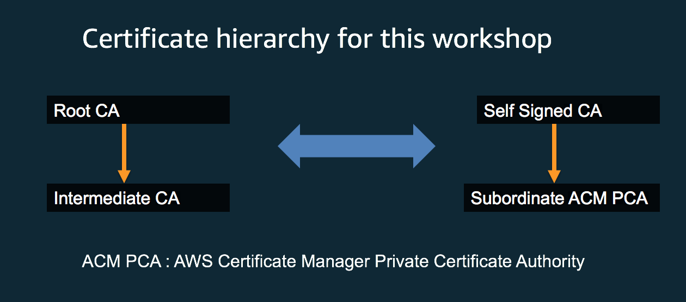

# Prerequisites

### AWS Account

If you are participating in this workshop as part of an AWS event, pre-provisioned temporary accounts that are specifically initialized for this workshop might be provided by the organizers. To access your temporary account you will receive a **12-digit hash code** that can be used at the [AWS Event Engine Site](https://dashboard.eventengine.run). You will not need a username and password.

If you wish to participate in this workshop without a pre-provisioned temporary account, please see the [AWS Initialization and tear down](#aws-initialization-tear-down) section below.

### Browser

These workshops assume that you are using the [Cloud9 IDE environment](https://aws.amazon.com/cloud9/). We recommend you use the latest version of Chrome or Firefox to complete this workshop. 

### Knowledge Of Python Programming Language

Basic python knowledge is sufficient to consume these workshops.

# Setup Workshop Environment

* Navigate to the Cloud9 service within your AWS console
* Open the Cloud9 IDE environment called **workshop-environment**. It takes about 30 seconds for the environment to start up.
* In the Cloud9 IDE environment you will find a folder called **data-protection** in the folder pane on the left side of the screen
* Right-click (on MacOS: control-click) the file named **environment-setup.sh**  in the IDE and select **Run**
* This script takes about a minute to complete
* In the runner window below you should see **SUCCESS: installed python dependencies ** followed by a list of the installed packages

# AWS Initialization & tear down

**IMPORTANT!** 
* This section is only relevant if you are **not** using a pre-provisioned account. 
* The resources used in this workshop **will incur charges** in the AWS account used if not torn down according to the procedure outlined below

You can use a **personal account** or create a **new AWS account** to ensure you have the neccessary access. This should not be an AWS account from the company you work for. Please note that creating an AWS account takes time (credit card validation, etc.) and is not recommended when participating in the workshop during a time constrained event.

### Region Support

Since these workshops use the Cloud9 IDE, you can use run these workshops in the following regions where the AWS Cloud9 
service is available : 
* **N.Virginia** (us-east-1)
* **Ohio** (us-east-2)
* **Oregon** (us-west-2)
* **Ireland** (eu-west-1)
* **Singapore** (ap-southeast-1)

### Cloudformation templates for initial environment setup

Please download the [Data Protection Workshop cloudformation stack](cf-templates/template-workshops-setup.yaml) and launch it in your AWS account as this is required for all the workshops in this repository. To launch the stack you must go to the AWS Console and navigate to the CloudFormation service where you can choose **Create Stack** and upload the Cloudformation stack for the workshop. You provide a name for the stack and keep clicking **next** until you get to the point where it says:

```
I acknowledge that AWS CloudFormation might create IAM resources with custom names.
```

Acknowledge the above statement by clicking on the check box and then click on the **Create** button

The above stack creates an Cloud9 IDE environment called **workshop-environment**. 
In addition a VPC with two subnets and an internet gateway is also created.


## ACM Private Certificate authority - Private certs for your webserver 

This workshop demonstrates how ACM Private Certificate authority(PCA) can be created and made operational. It also helps you learn
about how ACM PCA can be used to generate private certificates for your devices or web servers. In this usecase you will generate a 
CSR(certificate signing request) for your device or server and then get it signed by the AWS Certificate manager private CA 

## Let's look at some concepts :

<a></a><br>

<a></a><br>

## Let's do some private cert generaton with AWS Certificate Manager(ACM) private certificate authority(PCA) :

Open the Cloud9 IDE environment called **workshop-environment** and navigate to the **data-protection/usecase-4** directory.
Follow the instructions below:

### Step 1 :

Run the python module named ***usecase-4-step-1.py***

* First you will see **Pending DynamoDB table creation for storing shared variables** printed on the runner window pane below
* Wait for about 45 seconds 
* You should see **shared_variables_crypto_builders DynamoDB table created** printed 

This module will create a DynamoDB table called **shared_variables_crypto_builders** . The primary purpose of this table is to share variables
across the different python modules that we will run in this usecase.

### Step 2 :

Run the python module named ***usecase-4-step-2.py***

* This module creates a ACM private certificate authority with the common name **acmpcausecase4.subordinate**
* This private certificate authority will publish certificate revocation lists within a S3 bucket whose name
  starts with **builder-acm-pca-usecase-4-bucket-pca-crl**
* You should see the following printed in the runner window pane
    * Private CA has been created
    * Please generate the CSR and get it signed by your organizations's root cert
    * Success : The ARN of the subordinate private certificate authority is : 
       arn:aws:acm-pca:<region>:<your-acccount-number>:certificate-authority/57943599-30d2-8723-1234-1cb4b7d81128
* In the AWS console browse to the AWS Certificate Manager service(ACM) . Under Private CA's you will see the private CA created and
  the status should show "Pending Certificate"

<a></a><br>

**Some questions to think about :**

* Why is the status of the private CA showing "Pending Certificate" ?
* Is the private certificate authority that's created a root CA or a subordinate CA ?
* What's the purpose of the S3 bucket storing certificate revocation lists ?

### Step 3 :

Run the python module named ***usecase-4-step-3.py***

* This module creates a self signed root certificate with the common name **rootca-builder**
* You can see in the code that the private key associated with the self signed cert is stored in an encrypted DynamoDB table.
  This is purely for demonstration purposes. In your organization you should store it in an HSM or a secure vault
* You should see the following printed in the runner window pane below 
   * Success - Self signed certificate file ***self-signed-cert.pem*** created"
   * This self signed certificate will be used in the certificate chain of trust
 
<a></a><br>

**Some questions to think about :**

* In your organization would you use the root cert to sign subordinate CA's ?
* Why is it necessary to store the private keys of root certs in an HSM ?
* What would happen if the private key of the root cert gets compromised or stolen ?

### Step 4 :

Run the python module named ***usecase-4-step-4.py***

* This module gets a Certificate signing request(CSR) for the private certifiate authority with 
  common name **acmpcausecas4.subordinate** that was created in **Step 2**
* The certificate signing request is signed using the self signed certificate and it's private key 
  that was created in **Step 3** 
* The signed cert is stored in a pem file called ***signed_subordinate_ca_cert.pem***
* You should see the following printed in the runner window pane below 
   * Successfully created signed subordinate CA pem file ***signed_subordinate_ca_cert.pem*** 

### Step 5 :

Run the python module named ***usecase-4-step-5.py***

* This module imports the subordinate CA signed certificate ***signed_subordinate_ca_cert.pem*** and 
  the certificate chain of trust into AWS Certificate Manager(ACM)
* The certificate chain contains the self signed or root CA certificate that we created in **Step 3**
* After this operation the subordinate private certificate authority(CA) changes status to ACTIVE. 
* Browse to the ACM service within the AWS console and you should see the status of the subordiate CA with 
  common name **acmpcausecase4.subordinate** as ACTIVE as shown below
* We are at a point where the subordinate private certificate authority(PCA) can issue private certificates
  for any endpoint, device or server
* You should see the following printed in the runner window pane below 
   * Successfully imported signed cert and certificate chain into ACM

<a></a><br>

### Step 6 :

**Time : 2 minutes**

Run the python module named ***usecase-4-step-6.py***

* This module takes about 2 minutes to complete 
* This module creates a CSR for a webserver endpoint with common name ***127.0.0.1*** and the CSR is then
  passed to the issue_certificate API call which sends the CSR to AWS Certificate Manager and is signed
  by the subordinate private certificate authority
* The signed webserver endpoint certificate pem file is called ***"webserver_cert.pem"***
* The issue_certificate API calls also returns the certificate chain of trust and the pem file that stores the
  certificate chain of trust is called ***"webserver_cert_chain.pem"***
* You should see the following printed in the runner window pane below 
    * Successfully created server certificate ***webserver_cert.pem*** for the flask web server
    * Successfully created chain of trust ***webserver\_cert_chain.pem*** for the flask web server

### Step 7 :

Run the python module named ***usecase-4-step-7.py***

* This module creates a python flask web server 
* The webserver is running within the Cloud9 environment and is exposed through the following
  URL **https://127.0.0.1:5000/** on port 5000
* You should see the following printed in the runner window pane below 
   * Running on https://127.0.0.1:5000/ 
* For the next steps this webserver needs to keep running. So please don't kill the runner window pane tab

### Step 8 :

Run the python module named ***usecase-4-step-8.py***

* This module uses the below curl command to do a HTTP GET on the flask webserver created in **Step 7** 

  curl --verbose -X GET https://127.0.0.1:5000/
  
* We are using the curl command to simulate a HTTPS web client 

* Since the curl commmand does not supply the certificate trust chain as a parameter the HTTPS connection is going to
  complain that the server certificate is not recognized. You will see the following printed in the runner window
  pane below if you look through the printed log 

  ** curl: (60) Peer's Certificate issuer is not recognized **
  
  ** Certificate is not trusted - cannot validate server certificate **

**Some questions to think about :**

* Why was the server certificate not recognized by the curl command ?

### Step 9 :

Run the python module named **usecase-4-step-9.py**

* This module uses curl to do a HTTPS GET on the flask webserver created in Step 7 using the following command :

  curl --verbose --cacert 'webserver_cert_chain.pem' -X GET https://127.0.0.1:5000/
  
* Since the curl command has the chain of trust pem file as a parameter the flask webserver certificate
  is successfully authenticated and you should see the following printed in the runner window pane.

  **Hello World!**
  
  **Certificate is trusted and is valid**
  
### Step 10 :

Run the python module named **usecase-4-step-10-cleanup.py**

* This module cleans up all the resources that were created as part of this usecase
* Please make sure that you run this cleanup script. Otherwise you will continue accruing charges for the ACM private
  certificate authority that was created during this usecase

### Tear down Cloudformation stack

After you have completed the workshop, you need to tear down the stack by navigating to the CloudFormation service in the AWS console and selecting the stack name you chose when launching the stack. If you are doing this workshop as
part of a AWS marketing with a pre-provisioned account provided by AWS you don't have to do any teardown

Choose the **delete** action and wait for the process to complete. Note that it can take a few minutes for the stack to clean up its resources.

## License Summary

This sample code is made available under a modified MIT license. See the [LICENSE](LICENSE) file.


