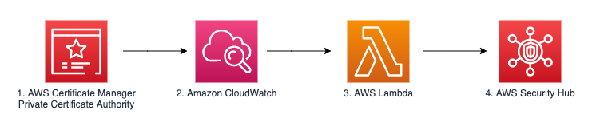

## Security Monitoring:

In this section we will look at how to monitor privileged actions as you build your certificate management infrastructure. We will study two scenerios. The creation of a CA Certificate and mass revocation of end entity certificates. 

#### 13. [Scenario 1]: Monitoring with Security Hub
Creating a CA Certificate is a privileged action that should only be taken by authorized personnel within the CA Hierarchy Management team. For this reason we want to monitor the creation of any CA Certificate within our hierarchy. 

To do this we will check the findings within Security Hub: [View results](https://github.com/aws-samples/data-protection/blob/master/usecase-9/img/SecHub.pdf).

#### 14. [Scenario 2]: Monitor Mass Revocation
This scenario shows a developer revoking many end-entity certificates within a short period of time. We want to monitor and notify the security team if this type of privileged action takes place in order to investigate.

#### 15. Create/Revoke End-Entity Certificates
First we will act as the Developer by creating and then revoking many certificates at once: [Mass revocation](https://github.com/aws-samples/data-protection/blob/master/usecase-9/img/Cloud9Instructions.pdf)

#### 16. Quiz time. Open this link in a new browser tab : [Quiz](https://amazonmr.au1.qualtrics.com/jfe/form/SV_3mHHKwvVlxQ0v1X)

#### 17. Monitor revocation of certificates
We will navigate to Security Hub in order to monitor revocation of certificates: [View results](https://github.com/aws-samples/data-protection/blob/master/usecase-9/img/RevokeCertsSecHub.pdf)
